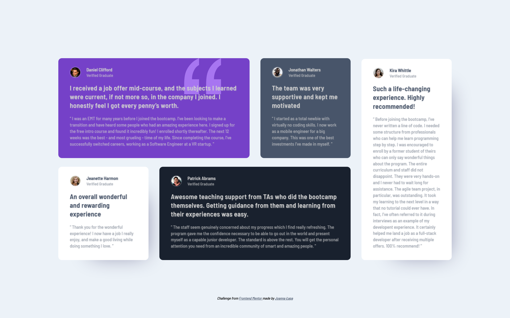

# Frontend Mentor - Testimonials grid section solution

This is a solution to the [Testimonials grid section challenge on Frontend Mentor](https://www.frontendmentor.io/challenges/testimonials-grid-section-Nnw6J7Un7). Frontend Mentor challenges help you improve your coding skills by building realistic projects. 

## Table of contents

- [Overview](#overview)
  - [The challenge](#the-challenge)
  - [Screenshot](#screenshot)
  - [Links](#links)
- [My process](#my-process)
  - [Built with](#built-with)
  - [What I learned](#what-i-learned)
  - [Continued development](#continued-development)
  - [Useful resources](#useful-resources)
- [Author](#author)

## Overview

### The challenge

Users should be able to:

- View the optimal layout for the site depending on their device's screen size

### Screenshot

### Links

- [Solution URL:](https://github.com/JoannaLapa/testimonials-grid-section-main)
- [Live Site URL:](https://joannalapa.github.io/testimonials-grid-section-main/)

## My process

### Built with

- Semantic HTML5 markup
- SCSS
- Flexbox
- CSS Grid
- Mobile-first workflow
- gulp

### What I learned

By this project I practised CSS Grid and SASS component structure 

### Continued development

My main aim for next month is practising SASS and JS. When I will decide that my skills on both of them are enough good I would like to learn Vue.js, Wordpress and PHP basics

### Useful resources

- [SASS Guidline](https://sass-guidelin.es/#architecture) - This helped me for SASS component structure reason. I really liked this pattern and will use it going forward.
- [SASS Boilerplate](https://github.com/KittyGiraudel/sass-boilerplate) - With this example I organised my SASS component structure.
- [SASS Documentation](https://sass-lang.com/documentation/) - and [Kevin Powell's video](https://www.youtube.com/watch?v=CR-a8upNjJ0) helped me with replacing @import with @use and @forward in my SASS component structure.
- [MMC School CSS Grid course](https://www.youtube.com/watch?v=Tqu3ssntMa4&list=PLxv_3XVN6Gc2Ki7m4H4vJAnDpnwysjD7C) - with this course I learnt about Grid basics.
- [A complete Guide to Grid](https://css-tricks.com/snippets/css/complete-guide-grid/) and [CSS Grid Layout](https://developer.mozilla.org/en-US/docs/Web/CSS/CSS_Grid_Layout#guides) - those 2 guides are perfect for learning CSS Grid.

## Author

- GitHub - [JoannaLapa](https://github.com/JoannaLapa)
- Frontend Mentor - [@JoannaLapa](https://www.frontendmentor.io/profile/JoannaLapa)
- LinkedIn - [@joanna-%C5%82apa-36a8b564](https://www.linkedin.com/in/joanna-%C5%82apa-36a8b564/)

